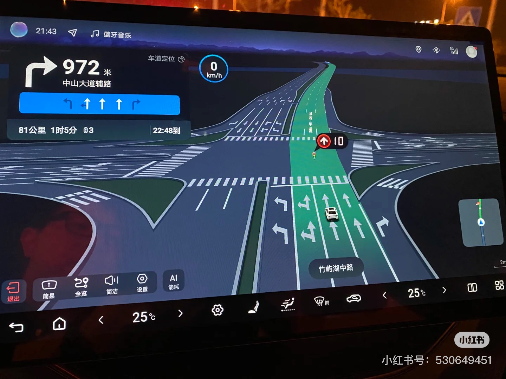

# 分享比亚迪 DiLink 内置的定制版地图

> 腾讯文档：https://docs.qq.com/aio/p/sc8axhs28s5bis8?p=5m0fAv5RoOObkSnOcYLfmQ

> 本文档及地图安装包**完全免费**，请勿通过任何渠道付费购买

> 文档内容较多，可以关注我的微信公众号 Cr4zy Uru5 并发送消息解答问题，点击链接底部头像关注：https://mp.weixin.qq.com/s/62B56x_dZMhUPSlBQAaIfw。公众号也会不定期分享地图更新的消息及比亚迪用车相关经验

> QQ交流群：710761038，[点击这里加入](http://qm.qq.com/cgi-bin/qm/qr?_wv=1027&k=1TenqhCphfgFTF2ycfm-uOIGEB7ar-uv&authKey=BtsWZWA9dTE5yOQMnJLMuY1vHid1Av0n%2Flbzeiolcjvob4Sf2wJmGW%2F8PZz8cLw3&noverify=0&group_code=710761038)，仅限比亚迪车主（包括五网四品牌：王朝/海洋/腾势/方程豹/仰望）

众所周知，比亚迪内置的定制版地图主要靠 OTA 来更新，由于 OTA 的频率低且推送速度慢，导致 DiLink 内置的地图很难得到更新。例如，DiLink 3.0 还在使用【高德地图】4.6 版本，且难以卸载和更新。现在有了新的选择，通过提取多个车型 DiLink 3.0/4.0/5.0 的【高德地图定制版】（渠道号：C04010083004）或 DiLink 5.0 的【百度地图定制版】，可以直接替换或更新内置的地图。安装包均由比亚迪官方签名无任何修改。地图来源为多媒体固件或 OTA 后的车机中提取，如果你的定制版地图版本还没有被文档收录，欢迎联系通过微信公众号联系我贡献版本。

## DiLink 版本说明

DiLink 对外宣传的版本号与内部平台版本号对应关系如下：

- 早期的 DiLink 1.0，控制器 1.x
- **DiLink 20**：对应 DiLink 2.0/2.1/2.2，其中 DiLink 2.0 控制器 2.x/4.x/5.x/8.x，CPU：高通 625；DiLink 2.1/2.2 控制器 26.x，CPU：联发科 P35。常见车型：海鸥/海豹 05/秦 PLUS/e7 中的低配车型
- **DiLink 50**：对应 DiLink 3.0/4.0，其中 DiLink 3.0 控制器 13.x/15.x/18.x，CPU：高通 665，常见车型：2021-2023 宋 Pro/宋 PLUS/宋 MAX/唐/元 Pro/元 PLUS/秦 PLUS/海豚等，2024 秦 L/海豹 06/海狮 05 等；DiLink 4.0 控制器 16.x/17.x/21.x，CPU：高通 690，常见车型：2023 汉/唐（低配）/海豹 EV/护卫舰 07 等
- **DiLink 100**：对应 DiLink 5.0，控制器 23.x，CPU：高通 778G/782G，常见车型：海豹 07 DM-i/海豹 06 GT/海狮 06/海狮 07/宋 L/腾势 N7/N8/D9/豹 5/钛 3，2023 唐（高配），2024 汉/唐/护卫舰07/海豹 EV 荣耀版车型，2025 宋 PLUS，以及智驾版车型；海外还有控制器 51.x，CPU：高通 8155（车规级芯片），车型：TANG/Sealion 7
- **DiLink 150**：对应 DiLink 5.1/6.0，其中DiLink 5.1 控制器 34.x，CPU：BYD 9000（车规级芯片），常见车型：夏/汉 L/唐 L/腾势 Z9/Z9 GT/N9/豹 8/钛 7 等；DiLink 6.0 控制器 31.x，CPU：高通 8+Gen1，车型：仰望 U7/U8/U9
- **DiLink 300**：控制器 41.x，CPU：联发科 MT8678（车规级芯片），车型：仰望 U8L

控制器版本及系统版本可在车辆设置中的多媒体详情查看，DiLink 版本可通过定制版地图工程模式的平台查看。平台的版本号格式通常为 `Di3.0_3.5UI`，前面版本号代表 DiLink 硬件版本，后面代表系统界面版本。具体说明可见：[一篇看懂 DiLink 智能座舱的各个版本](https://mp.weixin.qq.com/s/3g5sUALmA2sVSOqEVgneYg)

## DiLink 内置的定制版地图

### 针对智驾车型的重要说明

⚠️ 随着智驾的逻辑越来越多地集成在了【高德地图定制版】以及【百度地图定制版】中，地图与智驾的关系越来越紧密，带有天神之眼的智驾版车型请谨慎自行更新内置的地图，更新地图后可能会对智驾的驾驶行为产生一定的变化。且更新后的地图版本可能比亚迪尚未在你的车型上进行完整的车规级测试，可能会有潜在的缺陷，严重时会影响到智驾的安全性。如更新后遇到问题可参考下文降级回到出厂版本，耐心等待 OTA 推送新的地图更新。

### DiLink 2.1/3.0/4.0 高德地图定制版

DiLink 2.1/3.0/4.0 中的【高德地图定制版】支持红灯倒计时及绿波路段语音提醒（从 2.2.1.142 开始部分车型支持）、小迪语音导航、主题跟随系统、手机互联、仪表导航（18.x/21.x 支持）、剩余电量预估（从 2.1.3.123 开始支持）、巡航播报、AI 能耗（DM 5.0 车型支持）、惯性导航（2.2.6.3 部分车型会出现隧道中卡住的问题，可降级到 2.2.3.3）等功能，使用时不消耗车机流量，可读取车速等车辆信息。和高德官方版相比无自定义语音包（导航语音与小迪一致）、绿灯倒计时及巡航红绿灯倒计时（公众版仅特定版本有）。其中，2.1.3.140 的仪表导航 3D 效果更好。

适用于控制器 13.x/15.x/16.x/17.x 版本的车型安装，控制器 18.x/21.x/26.x 等 2023 年以后的车型已普遍内置此应用，如果出厂版本比网盘中的低，也可以覆盖安装更新版本。部分版本由于签名问题无法直接安装（标记为无签名），只能通过更新多媒体使用这些版本（更新方法参考下文）或 root 后安装为系统应用。

可以和旧版【高德地图】4.6 或【高德地图车机版】（公众版）共存，安装后需要在语音助手设置中将默认地图设置为【高德地图定制版】。

DiLink 2.1/3.0/4.0【高德地图定制版】最新版本是 2.2.25.3，更新记录见 [【高德地图定制版】更新记录](https://docs.qq.com/aio/DRVFzcXlJTVF0VkdT?p=8i4bKIQU1BAB3Hi4NapLDu)

DiLink 3.0/4.0【高德地图定制版】效果：


### DiLink 5.0/5.1 高德地图定制版

DiLink 5.0/5.1 中的【高德地图定制版】（从 3.0.515.1 开始应用名称显示为【地图】）功能比 DiLink 3.0/4.0 的更全面，可用于搭载该地图的 DiLink 5.0/5.1 车型更新出厂的地图版本，未搭载该地图的 DiLink 3.0/4.0 车型以及部分【百度地图定制版】的智驾车型也可以安装（仅限部分版本可使用）。支持红绿灯倒计时及绿波路段提醒（从 3.0.330.1 开始支持）、巡航红绿灯倒计时（从 3.0.605.1 开始支持）、仪表导航（需仪表硬件支持，DiLink 3.0/4.0 默认只有简易导航，全屏导航 18.x 可通过仪表全屏导航工具开启，21.x 暂不支持）、车道级导航（从 3.2.649.1 开始支持，仅汉 L/唐 L/腾势 D9/N9/Z9/Z9 GT/钛 7 等 DiLink 5.1 的车型）、灯光联动等。

对于 DiLink 3.0/4.0 车型因为是桌面类型应用无法直接安装，需要开启 ADB（可参考下文开启），再通过甲壳虫助手安装（应用管理，点击右下角加号选择 apk 安装）。可以与自带的地图共存。安装后不建议设置为默认桌面应用（保持 Launcher3 始终），若打开出现地图未激活，可连续点击未激活文字打开手动激活，点击激活按钮即可。该地图无法在小迪语音中设置为默认地图、不支持小迪语音导航（可通过安装【地图语音助手】解决，使用教程可查看：https://v.douyin.com/ifB9Rvu8/）。安装后打开出现闪退见下文常见问题 2。

对于 DiLink 5.0 车型可直接安装或覆盖升级，但 10 结尾的版本（例如 3.3.685.10）是 6.0UI，在 5.0UI 下界面存在一些问题不太适配。搭载【百度地图定制版】的 DiLink 5.0 车型最高只能使用 3.0.616.1（推荐 3.0.605.1），更高版本会提示不适配，且会存在一些问题，具体见下文常见问题 3。

DiLink 5.0/5.1【高德地图定制版】最新 5.0UI 的版本为 3.3.682.1，6.0UI 为 3.3.685.10，更新记录见 [【高德地图定制版】更新记录](https://docs.qq.com/aio/DRVFzcXlJTVF0VkdT?p=8i4bKIQU1BAB3Hi4NapLDu)

DiLink 3.0/4.0 使用 DiLink 5.0【高德地图定制版】效果：


DiLink 5.0 使用 DiLink 5.0【高德地图定制版】效果（支持巡航红绿灯倒计时）：


天神之眼 B 融合视觉定位的车道级导航，不支持仪表投屏显示：


部分具有天神之眼 C 的车型 DiLink 5.0【高德地图定制版】支持融合高快领航（HNOA）的车道级导航，且支持仪表投屏显示：


高德地图定制版有关车道级导航的更多图片：https://mp.weixin.qq.com/s/oCWpSphXKt7gfLfN76O8cA

### DiLink 6.0/300 高德地图定制版

此外也提取了 DiLink 6.0/300 中的【高德地图定制版】，目前 DiLink 3.0/4.0安装后无法使用，DiLink 5.0 部分车型（不带【高德地图定制版】的车型或【高德地图定制版】版本小于等于 3.0.440.1）可安装使用，但 bug 较多且需要在竖屏下使用，会覆盖自带的地图。DiLink 6.0/300 车型可以用于更新内置地图版本，注意选择有签名的版本安装。

DiLink 6.0【高德地图定制版】最新版本为 3.6.441.2，DiLink 300 最新版本为 3.7.468.9。更新记录见 [【高德地图定制版】更新记录](https://docs.qq.com/aio/DRVFzcXlJTVF0VkdT?p=8i4bKIQU1BAB3Hi4NapLDu)

DiLink 6.0/300【高德地图定制版】效果，支持车道级导航：


### 百度地图定制版

2025 年 DiLink 5.0 的大部分智驾车型搭载【百度地图定制版】（桌面上显示为【地图】），也是桌面类型应用，界面与 DiLink 5.0【高德地图定制版】高度接近，与百度地图汽车版 V21 不同。DiLink 4.0 需通过甲壳虫助手安装，可参考 DiLink 5.0【高德地图定制版】安装方式。安装后打开若出现激活失败本机号 null，请回到桌面长按图标打开信息，在存储中清除数据及缓存并授予所有权限（如果还无法使用，可尝试先安装 6.x 版本，再升级安装 4.4.24.8）。DiLink 5.0 可直接安装，智驾车型可更新到最新版本，非智驾车型若出现地图版本与本机不适配，需安装低版本 4.5.23.1。支持小迪语音导航（DiLink 4.0需将【高德地图定制版】设置为语音默认地图，在首次语音导航时将【地图】设置为默认应用；DiLink 5.0可直接设置）、仪表导航（DiLink 5.0 需停用或卸载【高德地图定制版】，否则可能会出现投屏闪退；DiLink 4.0 默认不支持仪表全屏导航，18.x 可通过仪表全屏导航工具开启）、红绿灯倒计时及巡航红绿灯等功能，部分功能与 3.0/4.0 系统存在兼容性问题（如：无法登录、DiLink 4.0 导航无播报声音）；若未出现巡航红绿灯功能，可尝试深度重启后重新安装再启动，并且多媒体系统需升级到 2024 年以上。仪表导航时仅支持全屏，不能小屏导航。注意 4.x/5.x 为新版本，2.x/6.x 为 2023 年以前的旧版本不建议安装。

由于 2025 年之前的 DiLink 5.0 系统中缺少登录组件（以后的已内置此组件），导致无法登录百度账号。若你的车机已经 root，可将登录组件 com.baidu.mapauto.pass 安装为系统应用，可解决无法登录的问题（不 root 无法直接安装），下载链接：https://pan.quark.cn/s/ed52ea1b8b71。DiLink 5.0 非智驾车型也可以升级多媒体系统解决。

部分智驾版车型可能会偶尔出现车道级导航（推荐车道指引），该功能尚未正式推送。

【百度地图定制版】最新版本为 5.0.3.1，更新记录见 [【百度地图定制版】更新记录](https://docs.qq.com/aio/DRVFzcXlJTVF0VkdT?p=IEIgWZ7v3cOzwrJ5e0FI1X)

【百度地图定制版】效果：




### 腾讯智驾地图定制版

2025 年的部分控制器 26.x 车型搭载【腾讯智驾地图】定制版，界面与公众版一致，也具备红绿灯倒计时、巡航红绿灯、车道级导航等功能，相比公众版多了仪表导航、获取车辆信息、AI 能耗等功能，因为与公众版包名一致但签名不一致无法共存。出厂未搭载该地图的车型暂时无法使用，会卡在启动界面并提示激活失败。

【腾讯智驾地图】定制版最新版本为 8.0.10.22802，更新记录见 [【腾讯智驾地图】定制版更新记录](https://docs.qq.com/aio/DRVFzcXlJTVF0VkdT?p=sEDTYy6qi0nGozwCWyysY9)。【腾讯智驾地图】公众版已改名为【腾讯地图车机版】，最新的版本为 9.0.0.354。

腾讯智驾地图定制版效果：


### Petal Maps 定制版

方程豹豹 5 部分车型/豹 8 搭载了华为乾崑智驾 ADS 系统，采用定制的 Petal Maps，多媒体系统仍是比亚迪的 DiLink 5.1。非华为智驾车型无法使用该地图。最新的版本为：3.3.0.423，更新记录见 [【Petal Maps】定制版更新记录](https://docs.qq.com/aio/DRVFzcXlJTVF0VkdT?p=JkZto2P50RuWAhTd86FSrA)。

## DiLink 应用商店中的地图

DiLink 应用商店中主要有以下几种地图：

### 高德地图车机版

商店中已不再更新，部分 2021 年车型的出厂搭载该版本，与公众版的包名一致。由于该版本和公众版的签名不同，无法直接覆盖安装升级，需借助【BYD 地图切换工具】彻底卸载再安装。公众版最新的版本为 8.5.0.600058｜SDK 850。

更新记录：

- 2021.1.8 更新版本 4.6.6.604459｜SDK 460
- 2020.4.16 更新版本 4.3.5.602175｜SDK 430
- 2019.6.1 更新版本 3.2.9.22915｜SDK 320

高德地图车机版效果：


### 高德地图手机版

与高德官网的版本无差别。功能全面，支持车道级导航、小迪语音等，但有广告且占用资源较多。可直接前往高德官网安装最新版。

### 百度地图

是基于百度地图汽车版 V20 定制的版本，使用了百度地图手机版的包名，与公众版略有不同。支持巡航红绿灯、车道级导航、小迪语音等。公众版最新的版本为 21.6.30。
更新记录：

- 2025.5.27 更新版本 20.14.2
- 2025.3.17 更新版本 20.14.1
- 2024.9.20 更新版本 20.1.7

百度地图汽车版 V20 效果：


## 地图相关教程

### 彻底卸载高德地图 4.6

从 13.x/15.x/26.x 的 2024 年的系统版本开始（16.x/17.x 不支持），支持彻底卸载旧版【高德地图】4.6。更新后，可通过安装【高德地图定制版】2.1.3.140 及以上的版本，打开后再通过长按换挡旁的滚轮深度重启车机，会自动卸载旧版【高德地图】，卸载后可直接安装高德官方的【高德地图车机版】。同时【高德地图定制版】变为系统应用不可卸载。如果【高德地图定制版】无法激活导致未能替换成功可安装【BYD 地图切换工具】，打开后点击设置为高德地图定制版，再深度重启即可。开机后【高德地图定制版】变成系统应用即切换成功。

- BYD 地图切换工具下载链接：https://pan.quark.cn/s/180e59f3a03d

### 更新多媒体系统

彻底卸载【高德地图】4.6 以及【百度地图定制版】支持登录等，需要更新多媒体（也称：车机/中控/Pad）系统以满足条件。更新教程可见：
[比亚迪多媒体系统及智驾控制器升级教程](https://mp.weixin.qq.com/s/zApRCPPJMQpPxvEQ5NA21A)

此外也会不定期分享新版多媒体固件，下载链接：https://pan.quark.cn/s/d34cdd0e1215。更多多媒体固件下载，可前往 BYDOTA 公众号：https://mp.weixin.qq.com/s/cyHUde0yrE-kvsQW5l_5Rg

- BYDOTA 二维码助手下载链接：https://pan.quark.cn/s/f6cc8f418d62，使用教程：https://mp.weixin.qq.com/s/DFi0zcESDUHZ7_qrJCjSFg
- OTA 验证码可访问 https://bydota.crazyurus.com/code 根据 IMEI 查询

### 开启 ADB 开关

开启 ADB 后将拥有更高权限，例如可以绕过限制安装桌面版地图、停用系统应用等。对于 DiLink 3.0/4.0 车型且系统版本在 2409 之前的版本，可直接安装旧版BYD 开发工具（具备 ADB 开关）替换车内的新版，替换后连续点击设置中的恢复出厂设置文字，即可开启无线 ADB 调试开关。2024 年 9 月及之后的系统不支持替换，可参考
[更新多媒体系统且不掉 ADB 的正确姿势](https://mp.weixin.qq.com/s/k2OB9kmtYw7lIe-ypMTWGQ)

对于 DiLink 5.0 车型只能通过企业微信扫描二维码开启。打开蓝牙电话应用，并在拨号键盘输入 `_#91532547#_`，即可调出扫码界面，需比亚迪售后工作人员扫码后可进入ADB开关操作界面。

- ADB 相关工具（ADB 开关、甲壳虫助手）下载地址：https://pan.quark.cn/s/d4f9c799a1e7

### 开启全屏仪表导航

控制器 18.x 的部分车型默认只有简易导航，可借助工具【Freedom】或一只汉堡包的【迪友桌面】（需 1.3.3 及以上）开启仪表全屏导航，也可以通过系统自带的 ClusterDebug 仪表调试工具手动开启。V 哥玩车有一篇详细的视频教程：https://mp.weixin.qq.com/s/EW80lgzduaQV5NIKlbM2_Q

- 开启仪表全屏导航工具下载链接：https://pan.quark.cn/s/fdb5c9bd395c

### 开启深浅主题模式

定制版地图的深浅主题跟随车机系统，但由于部分控制器 13.x/15.x 车型升级到 4.0UI 后设置中无深浅模式选项。可通过执行以下 ADB 命令（甲壳虫助手需从 content 开始输入）或使用【AutoUI】打开深浅模式选项：

```shell
$ adb shell content insert --uri content://carsettings/global --bind key:s:"support_change_system_uimode" --bind value:i:1
```

如需直接切换车机系统的深浅模式，可执行以下 ADB 命令，其中 0 表示自动，1 表示浅色，2 表示深色

```shell
$ adb shell content insert --uri content://carsettings/global --bind key:s:"sys_screen_mode" --bind value:i:0
```

- AutoUI 下载链接：https://pan.quark.cn/s/9b75aef99972

### 结合自动化使用地图

【迪加】【Tasker】【MacroDroid】等 App 均具备一定的自动化执行任务能力，我们可以借助这些 App 将地图与其它任务进行结合，例如实现车机启动即打开地图并导航到公司。以下是几种常见地图的指令，也可以将指令转换成 `Intent`、`scheme` 使用。

1. 高德地图车机版

```shell
// 回家
$ adb shell am start -d "androidauto://navi2SpecialDest?dest=home"

// 去公司
$ adb shell am start -d "androidauto://navi2SpecialDest?dest=crop"
```

1. DiLink 4.0 高德地图定制版

```shell
// 回家
$ adb shell am start -d "bydautomap://launch_go_home"

// 去公司
$ adb shell am start -d "bydautomap://launch_go_company"
```

1. DiLink 5.0 高德地图定制版

```shell
// 回家
$ adb shell am start -n com.byd.launchermap/com.byd.automap.activity.EmptyJumpActivity -e voice_operation_type voice_type_go_home

// 去公司
$ adb shell am start -n com.byd.launchermap/com.byd.automap.activity.EmptyJumpActivity -e voice_operation_type voice_type_go_company
```

1. 百度地图汽车版

```shell
// 回家
$ adb shell am start -d "baidumap://map/navi/common?addr=home"

// 去公司
$ adb shell am start -d "baidumap://map/navi/common?addr=company"
```

### 提取地图的安装包

借助第三方工具我们是可以从车机中提取定制版地图的 apk 文件。常用的工具有一个木函、MT 管理器、ES 文件浏览器，不需要开启 ADB。如果你开启了 ADB，也可以使用甲壳虫助手。具体教程可见：[如何从 DiLink 系统中提取已安装应用的 apk 文件](https://mp.weixin.qq.com/s/UW8E8W6Shwt3TL6P-BXPjQ)

- 一个木函下载链接：https://woobx.cn/#download

### 还原地图到内置版本

若你的车型出厂搭载定制版地图，需要降级或还原到内置版本，可使用【MT 管理器】卸载更新。详细教程：
[如何将系统应用还原到出厂版本](https://mp.weixin.qq.com/s/oZwtycTDknIdt7sQt7hawQ)

也可以使用【ES 文件浏览器】或【迪友桌面】实现，适用于 DiLink 4.0/5.0 系统。注意，如果你升级过车机系统（包括 OTA），系统内置的定制版地图版本可能会高于你的出厂版本，此时不能降级到低于当前内置的版本；若一定要降级，需要先降级多媒体的版本。

- ES 文件浏览器下载链接：http://www.estrongs.com/
- MT 管理器下载链接：https://mt2.cn/

## 地图功能对比

|                    | 仪表导航 | 红灯读秒 | 绿灯读秒 | 绿波路段 | 巡航红绿灯 | 车道级导航 | 智驾导航 | 语音唤醒 | 手车互联 | 惯性导航 | 电量预估 | 灯光联动 | 抬头显示 | 免流量 | AI 能耗 | 在线升级 |
| ------------------ | -------- | -------- | -------- | -------- | ---------- | ---------- | -------- | -------- | -------- | -------- | -------- | -------- | -------- | ------ | ------- | -------- |
| 高德地图车机版 4.6 | ❌       | ❌       | ❌       | ❌       | ❌         | ❌         | ❌       | ✅       | ❌       | ❌       | ❌       | ❌       | ❌       | ✅     | ❌      | ❌       |
| 高德地图车机版 8.x | ❌       | ✅       | ✅       | ✅       | ❌         | ❌         | ❌       | ✅       | ✅       | ❌       | ❌       | ❌       | ✅       | ✅     | ❌      | ✅       |
| 高德地图定制版 2.x | ✅       | ✅       | ❌       | ✅       | ❌         | ❌         | ❌       | ✅       | ✅       | ✅       | ✅       | ❌       | ✅       | ✅     | ✅      | ❌       |
| 高德地图定制版 3.x | ✅       | ✅       | ✅       | ✅       | ✅         | ✅         | ✅       | ✅       | ✅       | ✅       | ✅       | ✅       | ✅       | ✅     | ✅      | ❌       |
| 高德地图手机版     | ❌       | ✅       | ✅       | ✅       | ✅         | ✅         | ❌       | ✅       | ✅       | ❌       | ❌       | ❌       | ❌       | ❌     | ❌      | ✅       |
| 百度地图汽车版     | ❌       | ✅       | ✅       | ✅       | ✅         | ✅         | ❌       | ❌       | ✅       | ❌       | ❌       | ❌       | ❌       | ❌     | ❌      | ✅       |
| 百度地图定制版     | ✅       | ✅       | ✅       | ✅       | ✅         | ❌         | ✅       | ✅       | ✅       | ✅       | ✅       | ❌       | ✅       | ✅     | ✅      | ❌       |
| 百度地图手机版     | ❌       | ✅       | ✅       | ✅       | ✅         | ✅         | ❌       | ✅       | ✅       | ❌       | ❌       | ❌       | ❌       | ❌     | ❌      | ✅       |
| 腾讯智驾地图定制版 | ❌       | ✅       | ✅       | ✅       | ✅         | ❌         | ❌       | ✅       | ✅       | ✅       | ✅       | ❌       | ❌       | ✅     | ✅      | ❌       |
| 腾讯地图车机版     | ❌       | ✅       | ✅       | ✅       | ✅         | ✅         | ❌       | ❌       | ✅       | ❌       | ❌       | ❌       | ❌       | ❌     | ❌      | ✅       |

1. 仪表导航：DiLink 5.0【高德地图定制版】和【百度地图定制版】在 DiLink 4.0 下需配合开启全屏仪表导航工具或刷第三方固件开启；【高德地图车机版】默认仅有简易导航，经过车友修改的版本可借助飞屏功能实现仪表投屏。不支持的地图可通过【窗口管理器】强制投屏
1. 红灯倒计时：DiLink 4.0【高德地图定制版】从 2.2.1.142 开始支持，DiLink 5.0【高德地图定制版】从 3.0.330.1 开始支持
1. 绿灯倒计时：DiLink 4.0【高德地图定制版】无绿灯读秒，但支持绿灯状态显示
1. 绿波路段：DiLink 4.0【高德地图定制版】仅支持绿波路段语音提示，无界面展示
1. 巡航红绿灯倒计时：【百度地图定制版】支持，【高德地图定制版】从 3.1.605.1 开始支持。【高德地图车机版】7.5 也出现过支持的内测版本，部分车友的修改版也支持
1. 车道级导航：DiLink 5.0【高德地图定制版】目前仅在部分天神之眼车型支持车道级导航；【高德地图手机版】【百度地图手机版】支持高速、城市快速路车道级导航；【百度地图汽车版】【腾讯智驾地图】提供推荐车道的指引，而非真实的车道；【百度地图定制版】部分车型偶现推荐车道的指引
1. 智驾导航：仅具有天神之眼/乾崑智驾的车型可开启此功能
1. 小迪语音唤醒：DiLink 5.0【高德地图定制版】在 DiLink 4.0 下默认不支持语音唤醒，需搭配【地图语音助手】；【百度地图定制版】在 DiLink 4.0 下需通过设置默认地图为【高德地图定制版】，并在首次语音导航时选择【百度地图定制版】为默认打开应用；【腾讯智驾地图定制版】暂只支持部分车型语音唤醒。
1. 手车互联：指在车机版登录高德或百度账号后，相同账号的手机版可直接发送位置到车机，并共享数据和设置。DiLink 5.0【高德地图定制版】在 DiLink 3.0/4.0 下不支持手车互联，【百度地图定制版】的手车互联依赖登录组件才可以使用
1. 惯性导航：指隧道中无 GPS 信号时，是否支持通过 DiLink 接口读取车速进行位置计算，从而保持导航位置更新。若 DiLink 5.0【高德地图定制版】隧道中未出现车速信息，可尝试在工程模式中把开启惯导开关打开
1. 电量预估：指选择导航路径或目的地时，可根据车辆当前剩余电量进行评估，电量不足时给出提示。DiLink 5.0【高德地图定制版】在 DiLink 3.0/4.0 下不支持此功能
1. 灯光联动：指地图中的车模支持联动显示车辆的灯光状态，如：大灯、转向灯
1. 抬头显示：HUD 可以将导航等信息，投影到驾驶员前面的风挡玻璃上，部分车型具备此功能。除定制版外，【高德地图车机版】也可以支持
1. 免流量：指车机流量用完或到期后，地图是否仍支持联网使用，不消耗车机流量。也可通过车机上的流量统计查看地图的流量使用情况，如果使用量非常少则是免流量。免流量的策略和车型有关，通常车型出厂搭载的地图会免流量（无论是否升级版本），定制版地图大概率免流量，【高德地图车机版】部分车型免流量；从【高德地图车机版】8.5 开始不再免流量。
1. AI 能耗：指 DM 5.0 车型在定制版地图中有 AI 能耗开关，开启后可根据导航、环境、车辆状态及用车习惯，通过 AI 算法智能调节整车电量、HEV/EV模式，是智能保电的加强版。DiLink 5.0【高德地图定制版】在 DiLink 4.0 下不支持此功能
1. 在线升级：【百度地图汽车版】在部分低版本多媒体上可在线升级，高版本会提示多媒体不支持此操作，需前往 https://carmap.baidu.com/ 手动下载最新版本

## 地图及工具下载

- 比亚迪定制版地图：https://pan.quark.cn/s/a2b66b83d175
- 地图语音助手：https://pan.quark.cn/s/bf244d25c922，支持 DiLink 5.0 高德地图定制版/百度地图汽车版/腾讯地图车机版

## 常见问题

1. 安装 DiLink 4.0【高德地图定制版】出现暂时无法完成激活，请稍后重试，一般是车机出厂版本不带【高德地图定制版】的车型，无法使用【高德地图定制版】。可以通过这个网站查询是否能激活 https://automap.crazyurus.com/。2025.6.15 至 2025.8.5 曾短暂解除过激活限制，目前仍存在激活限制，具体参见：https://mp.weixin.qq.com/s/OkcGFsM6cqo4PxJLRGNybw
1. 安装 DiLink 5.0【高德地图定制版】后打开遇到闪退，13.x/18.x 需要升级你的车机系统版本为 2024 年及以上可使用 3.0.437.1，21.x 目前最高只能使用 3.0.404.1，如果你不想升级，可尝试 3.0.389.1 等更低版本；若导航过程中遇到闪退，需要将地图加入到系统加速的白名单中，允许后台运行。该地图在 DiLink 3.0/4.0 下无法设置新能源车牌，需先安装低版本 1.550.0.165 并完成车牌设置后，再升级地图
1. DiLink 5.0 目前有两种定制版地图，大部分天神之眼 C 车型出厂为【百度地图定制版】，非智驾车型、天神之眼 C 中宋 L EV/汉 L/唐 L/唐 DM-i 智驾版/钛3 Ultra、天神之眼 B 车型出厂为【高德地图定制版】。当安装不匹配的定制版地图时，会出现深度重启后消失（例如【百度地图定制版】车型安装 DiLink 5.0【高德地图定制版】），解决方法可见：https://mp.weixin.qq.com/s/qU8IjENHe22VJ8qmSIZGoA
1. 若同时安装 DiLink 4.0 和 5.0 的【高德地图定制版】，且仪表全屏导航时出现地图应用选择界面，可使用窗口管理器将选择界面切换到车机中再进行操作，选择 5.0 图标的选项为默认，或使用甲壳虫停用 DiLink 4.0 的【高德地图定制版】避免冲突
1. 若安装 DiLink 4.0【高德地图定制版】出现应用未安装，检查是否安装了【小迪导航】，因为该应用占用了【高德地图定制版】的包名，需要先卸载；安装高德地图车机版】7.1 及以上版本出现应用未安装，参照彻底删除【高德地图】4.6 卸载后再安装
1. DiLink 4.0【高德地图定制版】的红灯倒计时功能由比亚迪服务器根据车型控制，2025 年 8 月 4 日起所有车型都开放了红灯倒计时功能。在【高德地图定制版】进入工程模式，将比亚迪服务器环境选项设置为开发环境的方法已失效，请勿修改
1. 彻底卸载 4.6 使用公众版后，隧道自动内循环功能会失效，若需要恢复 4.6，可在网盘下载或比亚迪应用商店搜索【高德地图车机版】重新安装。使用【高德地图定制版】无此问题
1. 宋 L EV、海狮 07 EV 等部分搭载 AR-HUD 的车型需安装 1 结尾的版本且保持多媒体最新，否则 HUD 功能可能会不正常，其余控制器 23.x 车型安装 DiLink 5.0/5.1 的最新版本即可；控制器 34.x 建议安装 4 结尾（高德地图定制版）或 8 结尾（百度地图定制版）的版本（如 3.0.528.4）
1. 【高德地图定制版】与【高德地图车机版】对应关系可以看定制版地图的版本号，如：2.2.3.3.710.1.20240816.2，使用 AutoSDK 710，对应公众版 7.1；3.0.450.4.750.1.202410280952.6，使用 AutoSDK 750，对应公众版 7.5；3.5.378.2.810.1.202502201150.9，使用 AutoSDK 810，对应公众版 8.1

## 总结

1. DiLink 3.0/4.0 车型推荐使用 DiLink 4.0【高德地图定制版】2.2.25.3，功能偏少但稳定无缺陷；也可使用 DiLink 5.0【高德地图定制版】3.0.437.1，缺失的部分功能需借助【地图语音助手】补齐；也可使用【百度地图定制版】4.4.24.8 用于巡航时查看红绿灯及仪表投屏
1. DiLink 5.0 车型推荐使用对应的出厂地图。搭载【高德地图定制版】的车型，可直接更新到最新版本；也可使用【百度地图定制版】4.4.24.8，升级到 2025 年的系统后地图功能会更稳定。搭载【百度地图定制版】的车型，可直接更新到最新版本；也可使用DiLink 5.0【高德地图定制版】3.0.605.1。搭载华为乾崑智驾的车型，推荐【Petal Maps】
1. DiLink 2.1/2.2 车型推荐使用对应的出厂地图：【高德地图定制版】或【腾讯智驾地图】
1. DiLink 6.0 车型推荐使用对应的【高德地图定制版】
1. 也可以选择以下几种公众版的地图：
   1. 高德地图车机版。控制器 18.x/21.x/23.x/34.x 可直接安装，13.x/15.x/26.x 可参照上文的教程，彻底卸载 4.6 高德地图，从而安装公众版【高德地图车机版】。下载链接：https://www.amapauto.com/download
   1. 高德地图手机版。下载链接：https://mobile.amap.com/
   1. 腾讯地图车机版。下载链接：https://tai.qq.com/navi/pages/index/
   1. 百度地图手机版。下载链接：https://map.baidu.com/zt/client/index/
   1. 百度地图汽车版。64 位下载链接：https://carmap.baidu.com/，32 位下载链接：https://opn.baidu.com/map/2025/v21/
